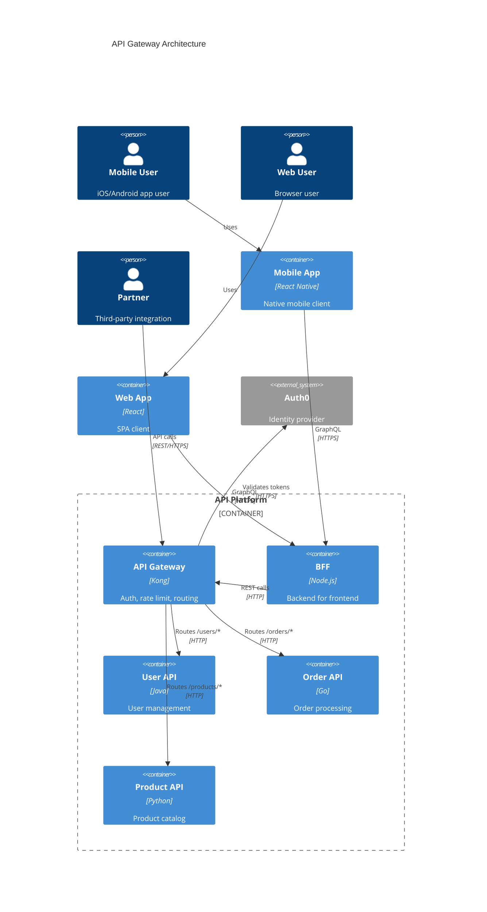
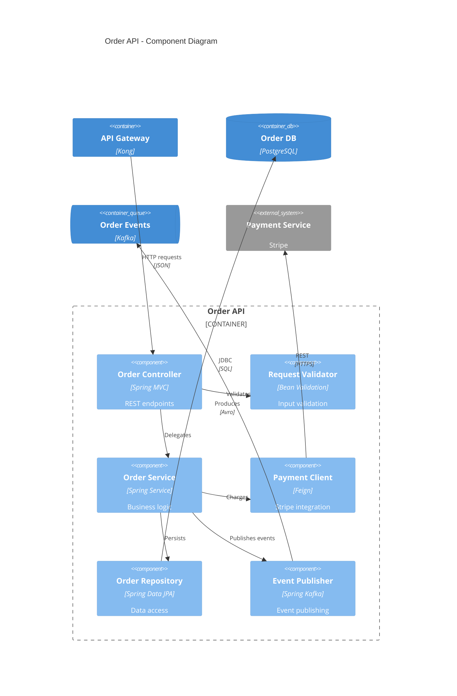
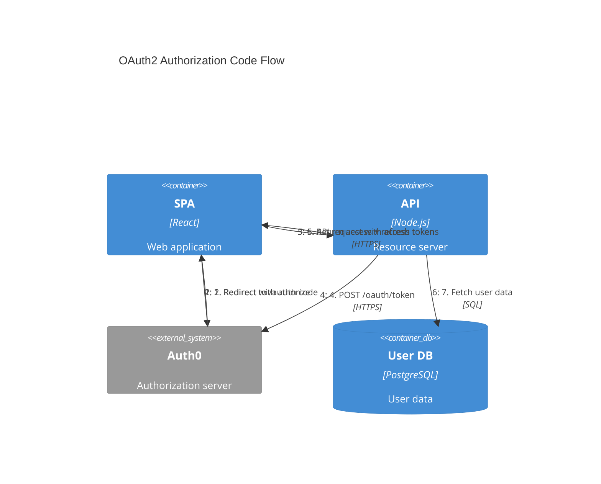
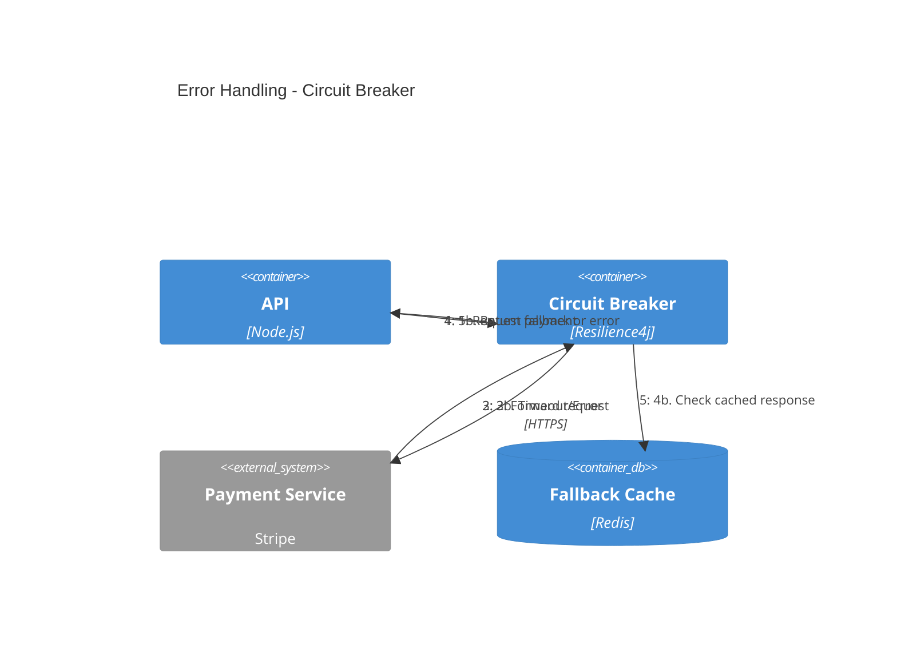
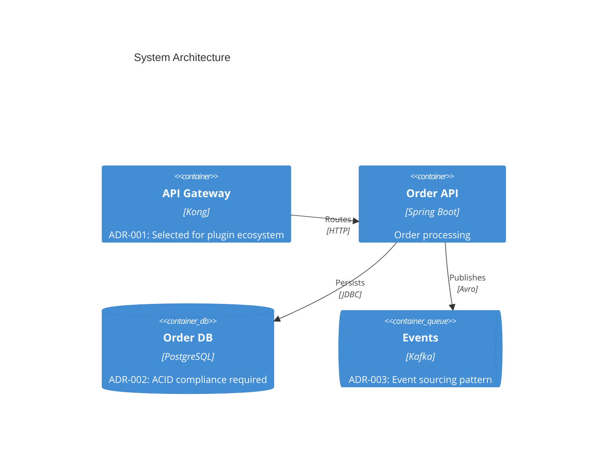
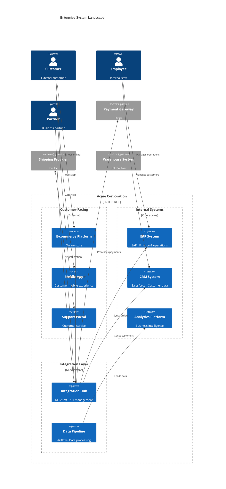

# Advanced C4 Architecture Patterns — Documentation, Landscape, and Practices

This file continues [advanced-patterns.md](advanced-patterns.md) with API documentation patterns, supplementary diagrams, ADR integration, system landscape diagrams, and the best-practices summary. For microservices, event-driven, and deployment patterns, see the main file.

---


## API Documentation Patterns

### API Gateway Pattern



### API Component Detail



## Supplementary Diagram Patterns

### Authentication Flow (Dynamic)



### Error Handling Flow



## Architecture Decision Record Integration

Link C4 diagrams to Architecture Decision Records (ADRs):

### ADR Reference in Diagrams



### Directory Structure

Organize C4 diagrams with ADRs:

```
docs/
├── architecture/
│   ├── c4-context.md
│   ├── c4-containers.md
│   ├── c4-components-order-api.md
│   ├── c4-deployment-production.md
│   └── c4-dynamic-auth-flow.md
└── decisions/
    ├── 001-api-gateway-selection.md
    ├── 002-database-selection.md
    ├── 003-event-driven-architecture.md
    └── template.md
```

## System Landscape Diagram

For enterprise-level views showing multiple systems:



## Best Practices Summary

1. **Choose abstraction based on ownership**: Single team = containers, Multi-team = systems
2. **Show individual message topics**: Not a single "Kafka" or "RabbitMQ" box
3. **Use deployment diagrams for infrastructure**: Keep container diagrams logical
4. **Create dynamic diagrams for complex flows**: Authentication, payment, error handling
5. **Link to ADRs**: Document why decisions were made
6. **Use system landscape for enterprise views**: Show all systems and their relationships
7. **Keep diagrams focused**: One concern per diagram, split when complex


---

See also: [advanced-patterns.md](advanced-patterns.md) for microservices, event-driven, and deployment patterns.
