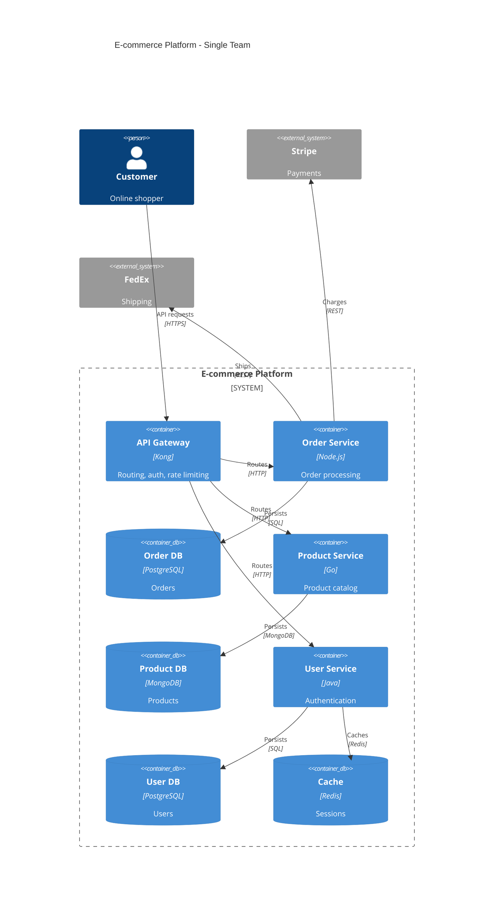
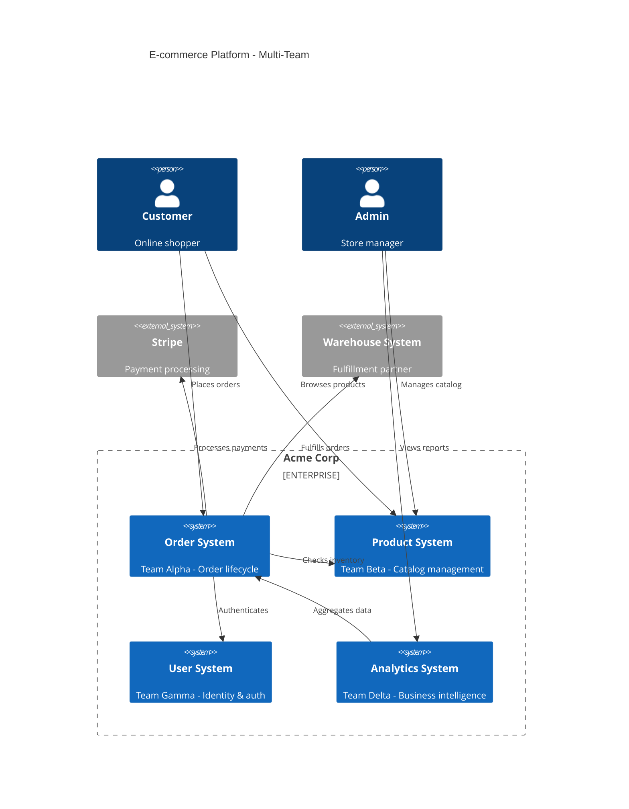
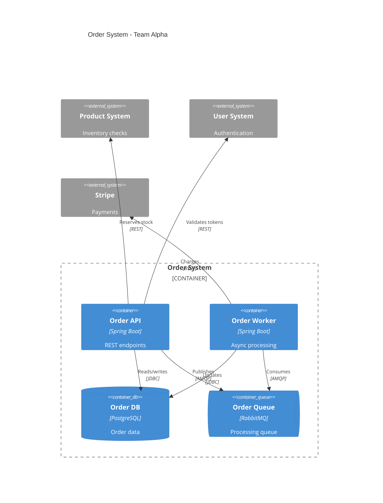
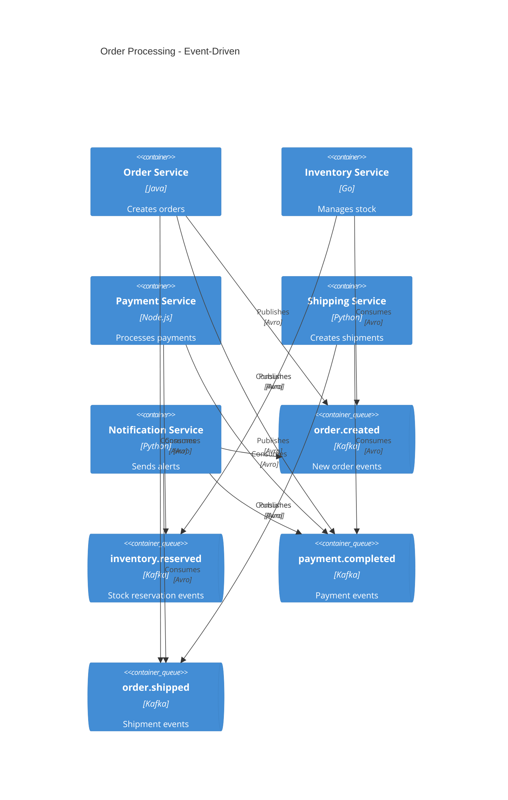
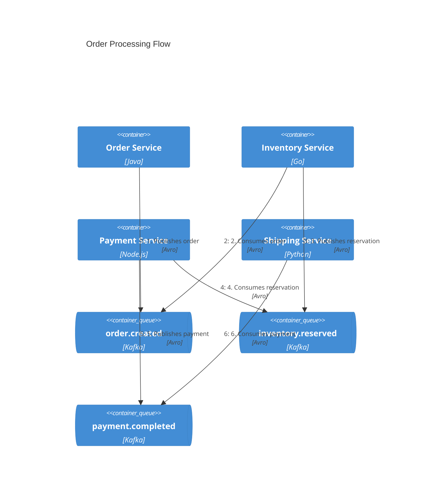
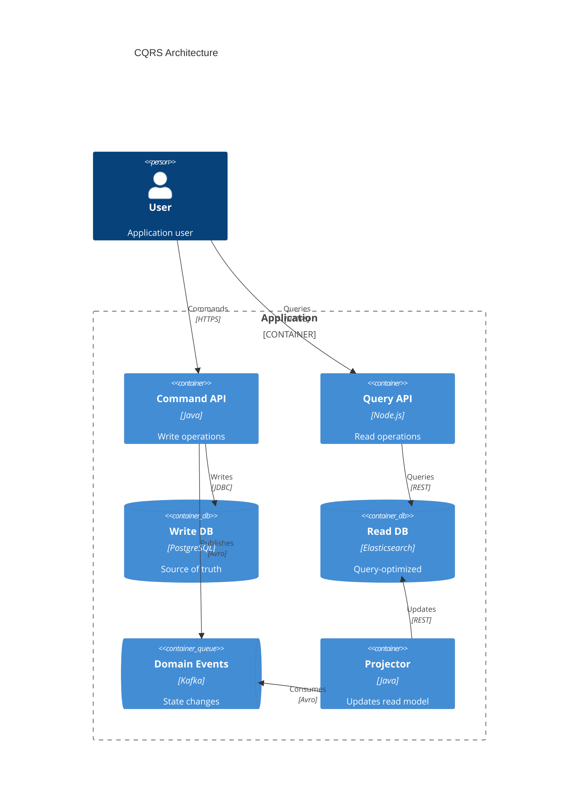
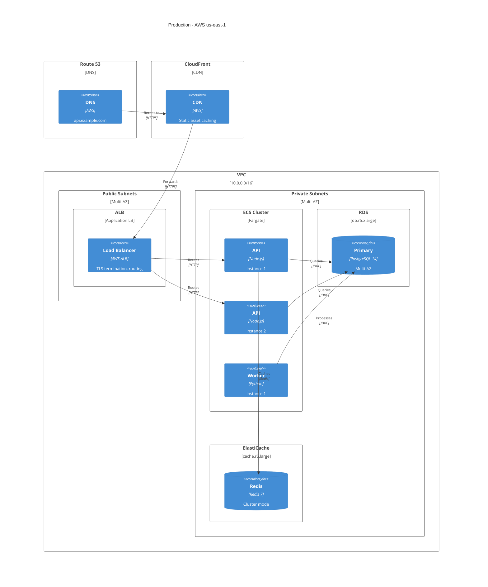
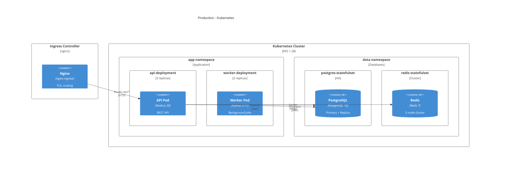
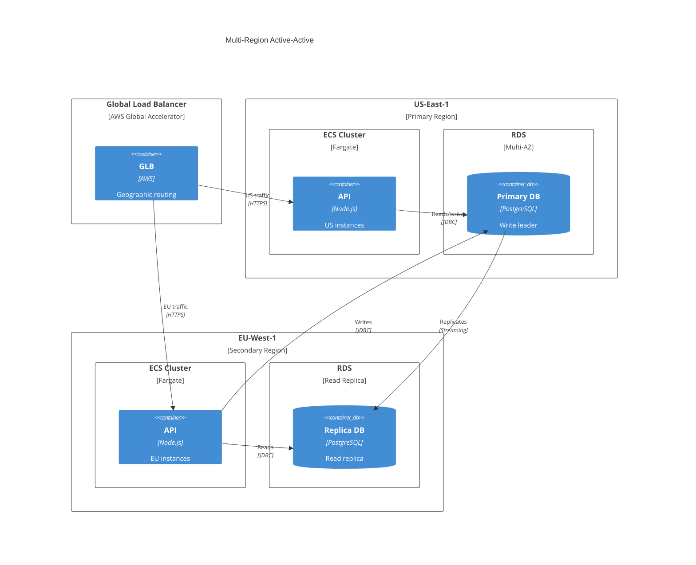

# Advanced C4 Architecture Patterns

This guide covers advanced patterns for documenting complex architectures including microservices, event-driven systems, deployments, and API documentation.

## Microservices Architecture

### Single Team Ownership

When one team owns all microservices, model them as **containers** within a single system:

### Multi-Team Ownership

When separate teams own microservices, **promote each to a software system**:

Each team then creates their own Container diagram:

## Event-Driven Architecture

### Showing Individual Topics

Always model message topics/queues as separate containers:

### Event Flow with Dynamic Diagram

Use Dynamic diagrams to show the sequence of events:

### CQRS Pattern

## Deployment Patterns

### AWS Production Deployment

### Kubernetes Deployment

### Multi-Region Deployment

---

See also: [advanced-patterns-docs-landscape.md](advanced-patterns-docs-landscape.md) for API documentation, supplementary diagrams, ADR integration, system landscape, and best-practices summary.
