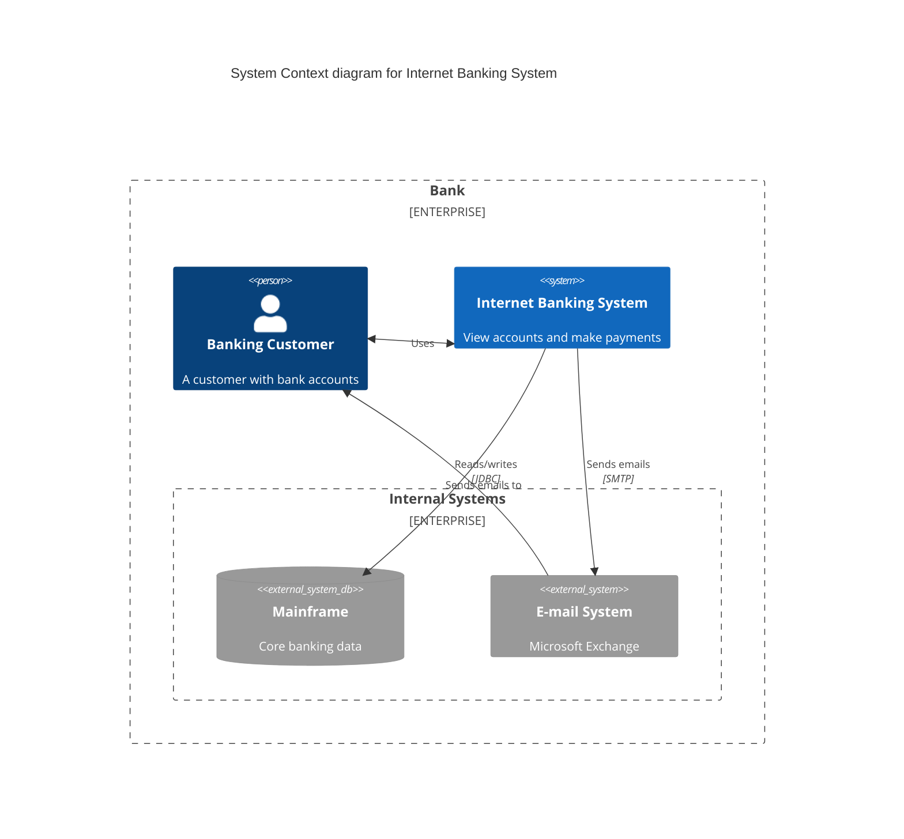
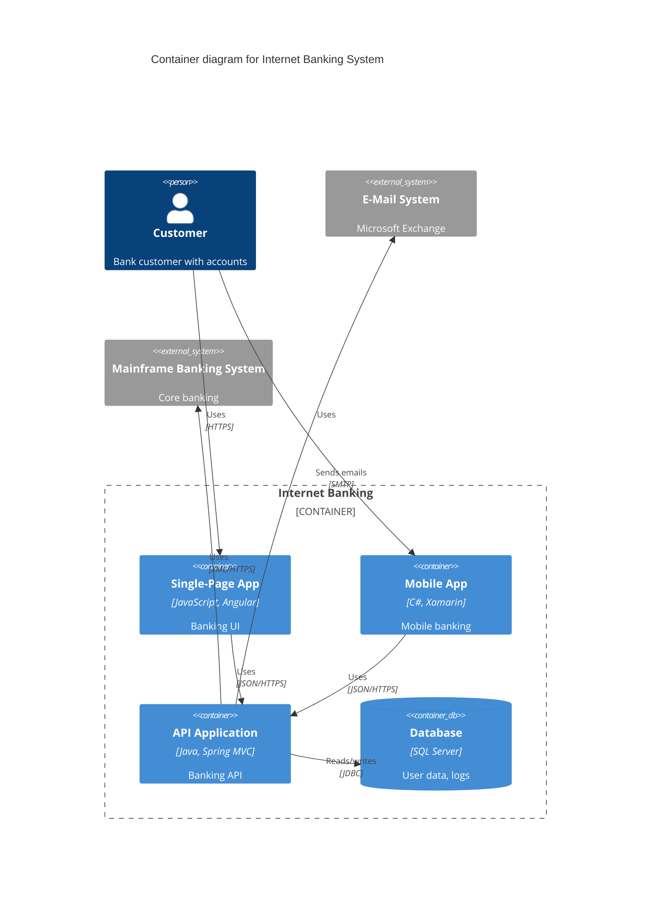
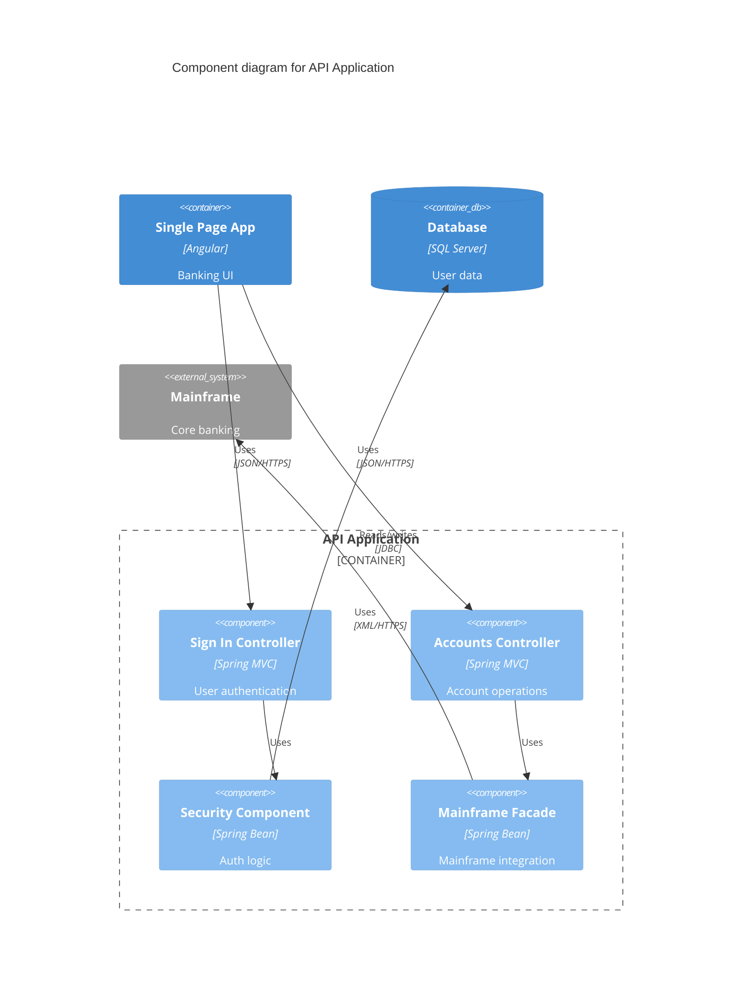
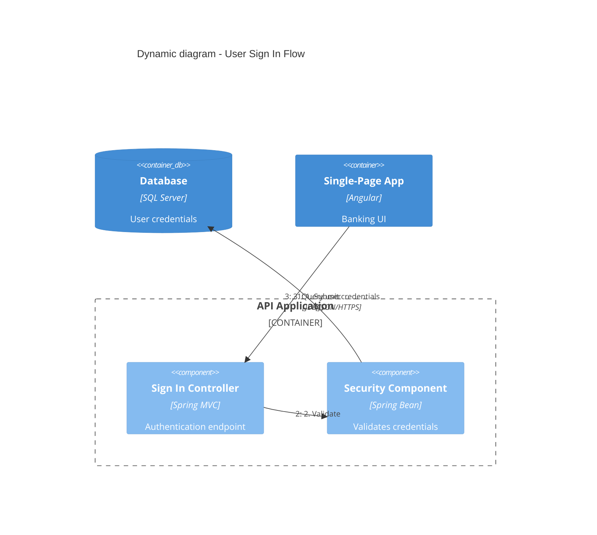
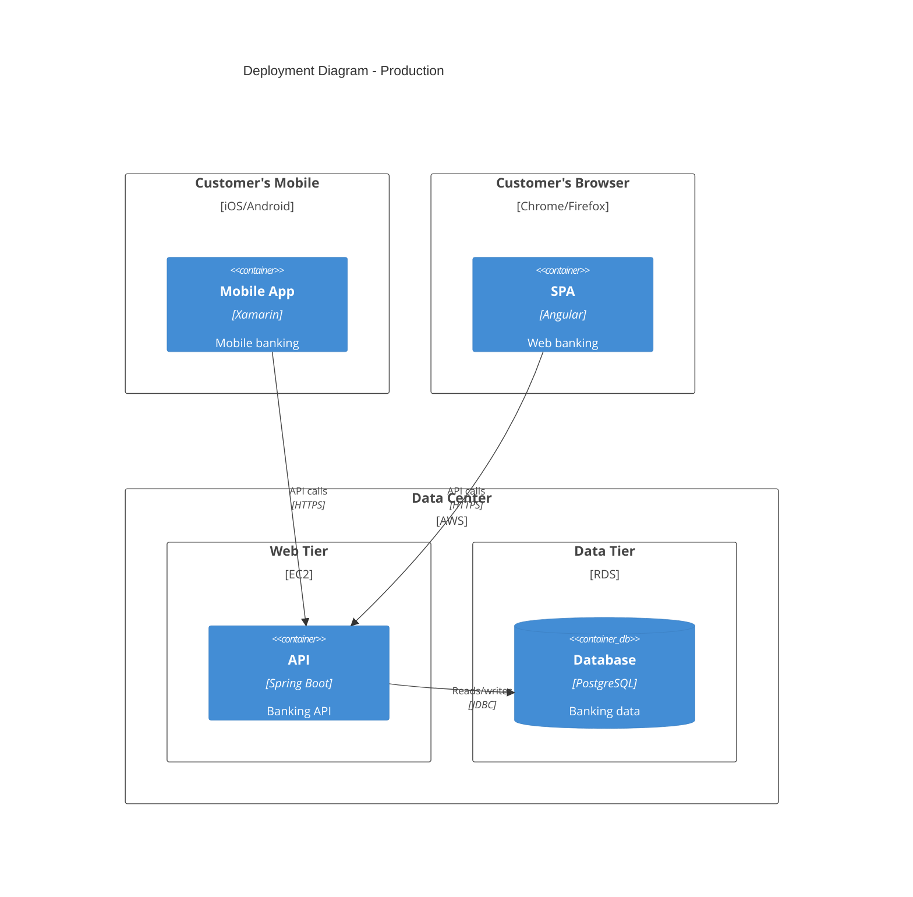
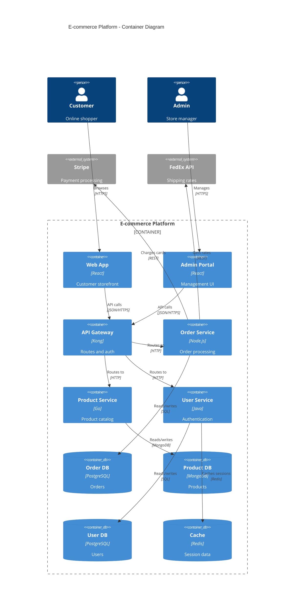
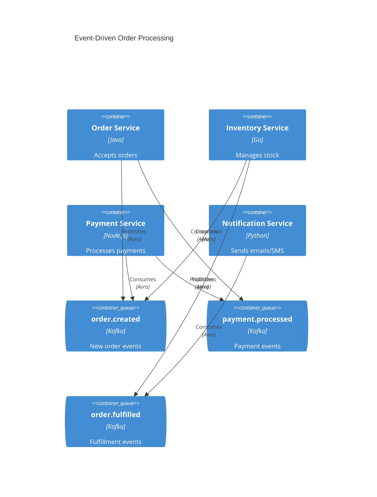

# C4 Mermaid Diagram Syntax — Complete Examples

Worked end-to-end C4 diagrams and Mermaid rendering limitations. For syntax reference (diagram types, elements, relationships, boundaries, styling, layout, parameters), see [c4-syntax.md](c4-syntax.md).

---


## Complete Examples

### C4Context Example


### C4Container Example


### C4Component Example


### C4Dynamic Example


### C4Deployment Example


### E-commerce Microservices Example


### Event-Driven Architecture Example


### AWS Deployment Example
```mermaid
C4Deployment
  title Production Deployment - AWS

  Deployment_Node(cdn, "CloudFront", "CDN") {
    Container(static, "Static Assets", "S3", "HTML/CSS/JS")
  }

  Deployment_Node(vpc, "VPC", "10.0.0.0/16") {
    Deployment_Node(publicSubnet, "Public Subnet", "10.0.1.0/24") {
      Deployment_Node(alb, "Application Load Balancer", "ALB") {
        Container(lb, "Load Balancer", "AWS ALB", "Routes traffic")
      }
    }

    Deployment_Node(privateSubnet, "Private Subnet", "10.0.2.0/24") {
      Deployment_Node(ecs, "ECS Cluster", "Fargate") {
        Container(api1, "API Instance 1", "Node.js", "REST API")
        Container(api2, "API Instance 2", "Node.js", "REST API")
      }

      Deployment_Node(rds, "RDS", "Multi-AZ") {
        ContainerDb(primary, "Primary DB", "PostgreSQL", "Main database")
        ContainerDb(replica, "Read Replica", "PostgreSQL", "Read scaling")
      }
    }
  }

  Rel(cdn, alb, "Forwards requests", "HTTPS")
  Rel(lb, api1, "Routes to", "HTTP")
  Rel(lb, api2, "Routes to", "HTTP")
  Rel(api1, primary, "Writes to", "JDBC")
  Rel(api2, replica, "Reads from", "JDBC")
```

## Mermaid Limitations

The following PlantUML C4 features are not yet supported in Mermaid:

### Unsupported Features
- `sprite` - Custom icons
- `tags` - Element tagging
- `link` - Clickable links
- `Legend` - Auto-generated legends
- `AddElementTag` / `AddRelTag` - Tag styling
- `RoundedBoxShape` / `EightSidedShape` - Custom shapes
- `DashedLine` / `DottedLine` / `BoldLine` - Line styles
- Layout directives (`Lay_U`, `Lay_D`, `Lay_L`, `Lay_R`)

### Workarounds

**Layout Control:**
Use `UpdateLayoutConfig` to control shape positioning instead of layout directives.

**Overlapping Labels:**
Use `UpdateRelStyle` with `$offsetX` and `$offsetY` to move relationship labels.

**Complex Diagrams:**
Keep diagrams under 15 elements. Split complex architectures into multiple focused diagrams.

**Element Ordering:**
Elements appear in the order they are defined. Reorder statements to adjust layout.

### Alternative Tools

For features Mermaid doesn't support, consider:
- **Structurizr DSL** - Full C4 support with model-based generation
- **C4-PlantUML** - More mature C4 implementation
- **IcePanel** - Visual C4 diagram editor


---

See also: [c4-syntax.md](c4-syntax.md) for the element/relationship/styling reference.
