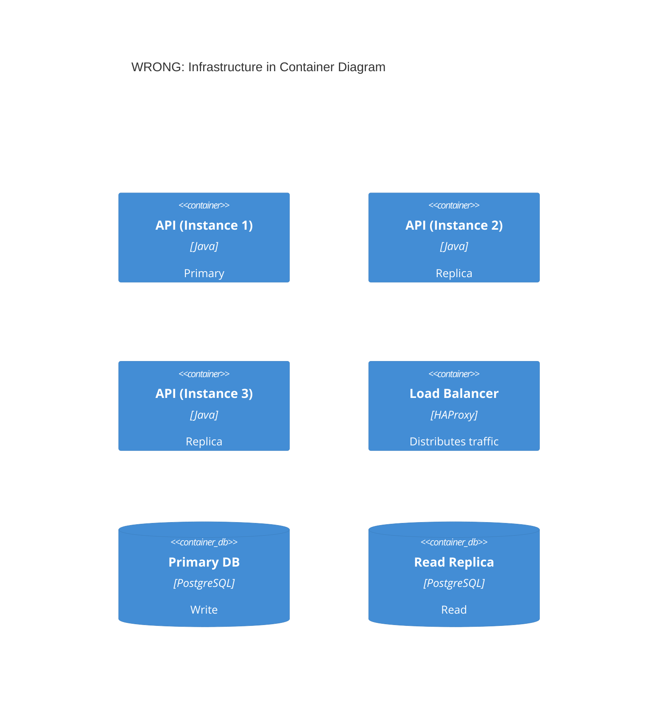
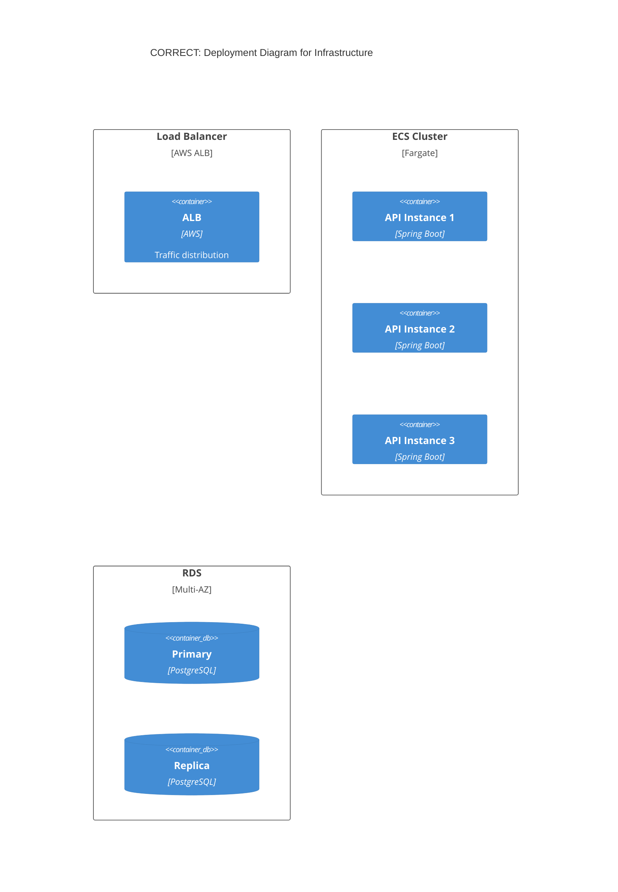

# Common C4 Model Mistakes to Avoid — Advanced

This guide continues [common-mistakes.md](common-mistakes.md) with scope, arrow, deployment, consistency, and decision-documentation anti-patterns. See the main file for abstraction, shared-library, broker, external-system, and metadata mistakes.

---


## Diagram Scope Mistakes

### 1. Not Tailoring to Audience

**The Problem:**
Showing Level 4 code diagrams to executives, or only Level 1 to developers who need implementation details.

| Audience | Appropriate Levels |
|----------|-------------------|
| Executives | Level 1 (Context) only |
| Product Managers | Levels 1-2 |
| Architects | Levels 1-3 |
| Developers | All levels as needed |
| DevOps | Levels 2 + Deployment |

### 2. Creating All Four Levels by Default

**The Problem:**
Not every system needs all four levels. Level 3 (Component) and Level 4 (Code) often add no value.

**Guidance:**
- **Always create:** Context (L1) and Container (L2)
- **Create if valuable:** Component (L3) for complex containers
- **Rarely create:** Code (L4) - let IDEs generate these

### 3. Too Many Elements Per Diagram

**The Problem:**
Diagrams with 20+ elements become unreadable.

**Simon Brown's advice:** "If a diagram with a dozen boxes is hard to understand, don't draw a diagram with a dozen boxes!"

**Solutions:**
- Split by bounded context or domain
- Create separate diagrams per service
- Show one service + its direct dependencies
- Use multiple focused diagrams instead of one comprehensive diagram

## Arrow Mistakes

### 1. Bidirectional Arrows

**The Problem:**
Bidirectional arrows are ambiguous. Who initiates the call? What flows each direction?

**Wrong:**
```
BiRel(frontend, api, "Data")  # Ambiguous direction
```

**Correct:**
```
Rel(frontend, api, "Requests products", "JSON/HTTPS")
Rel(api, frontend, "Returns product data", "JSON/HTTPS")
```

Or show the initiator's perspective:
```
Rel(frontend, api, "Fetches products", "JSON/HTTPS")
```

### 2. Unlabeled Arrows

**The Problem:**
Arrows without labels force readers to guess what flows between elements.

**Wrong:**
```
Rel(orderSvc, paymentSvc)
```

**Correct:**
```
Rel(orderSvc, paymentSvc, "Requests payment authorization", "gRPC")
```

## Deployment Diagram Mistakes

### 1. Deployment Details in Container Diagrams

**The Problem:**
Container diagrams should show logical architecture, not infrastructure details.

**Wrong - Infrastructure in container diagram:**


**Correct - Use Deployment diagram for infrastructure:**


### 2. Missing Environment Context

**The Problem:**
Deployment diagrams should specify which environment (production, staging, dev).

**Wrong:**
```
C4Deployment
  title Deployment Diagram  # Which environment?
```

**Correct:**
```
C4Deployment
  title Deployment Diagram - Production (AWS us-east-1)
```

## Consistency Mistakes

### 1. Inconsistent Notation Across Diagrams

**The Problem:**
Using different colors, shapes, or terminology for the same elements across diagrams.

**Wrong:**
- Context diagram: "Payment System" (blue)
- Container diagram: "Payment Service" (green)
- Component diagram: "Payment Module" (red)

**Correct:**
Use consistent naming, colors, and styling. Create a style guide for your team.

### 2. No Legend/Key

**The Problem:**
Assuming viewers understand your notation without explanation.

**Solution:**
Always include a legend explaining colors, shapes, and line styles. Even for "obvious" elements.

## Decision Documentation Mistakes

### Showing Decision Process in Diagrams

**The Problem:**
Architecture diagrams show **outcomes** of decisions, not the decision-making process.

**Wrong approach:**
Including "Option A vs Option B" annotations in diagrams.

**Correct approach:**
- Document decisions separately in Architecture Decision Records (ADRs)
- Link ADRs to relevant diagrams
- Diagrams show the chosen architecture, ADRs explain why

## Quick Reference: Checklist

Before finalizing any C4 diagram, verify:

- [ ] Every element has: name, type, technology (if applicable), description
- [ ] All arrows are unidirectional with action verb labels
- [ ] Technology/protocol included on relationships
- [ ] Diagram has a clear, specific title
- [ ] Under 20 elements (ideally under 15)
- [ ] Appropriate level for the target audience
- [ ] Containers are deployable, components are not
- [ ] External systems shown as black boxes
- [ ] Message topics shown individually (not as single broker)
- [ ] No infrastructure details in container diagrams
- [ ] Consistent with other diagrams in the set


---

See also: [common-mistakes.md](common-mistakes.md) for abstraction, shared-library, broker, external-system, and metadata mistakes.
