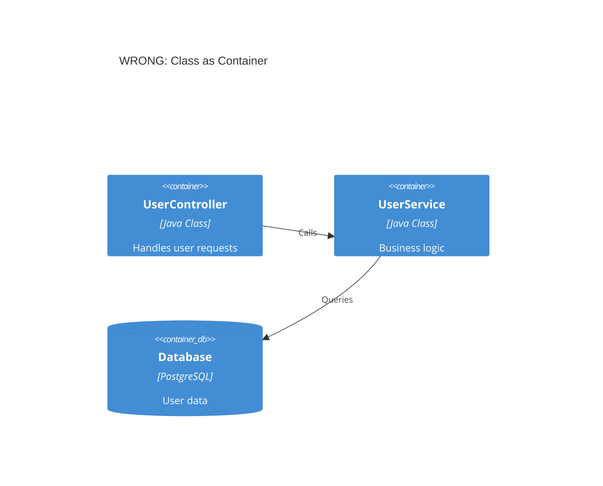
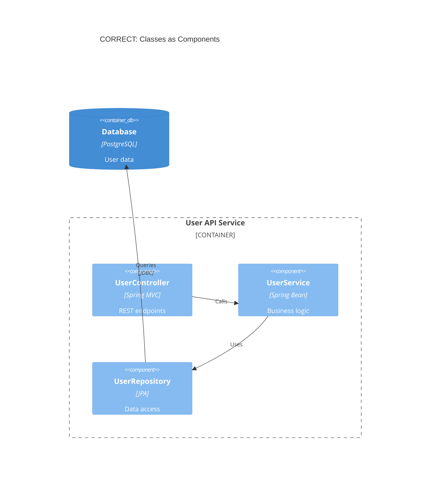
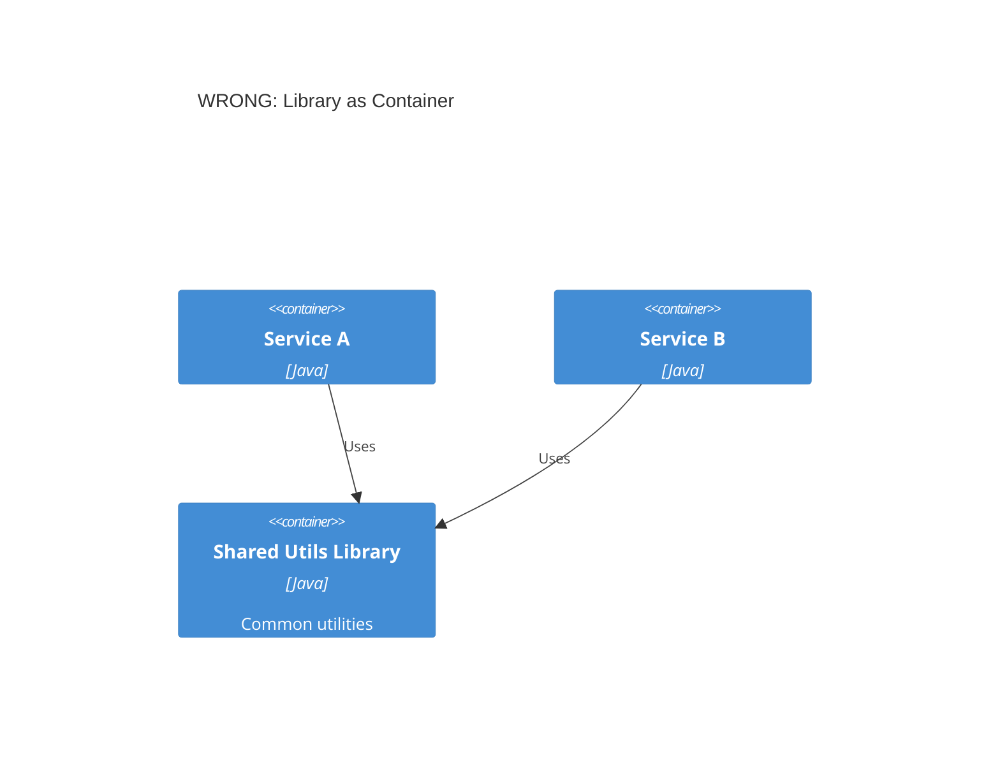
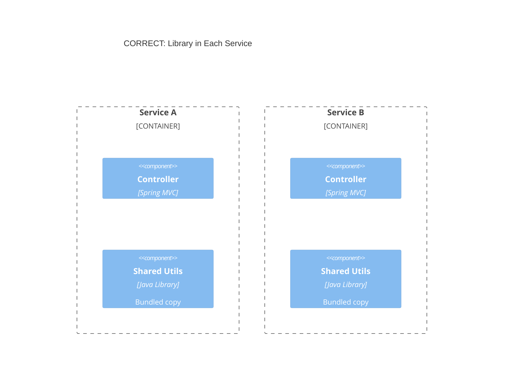
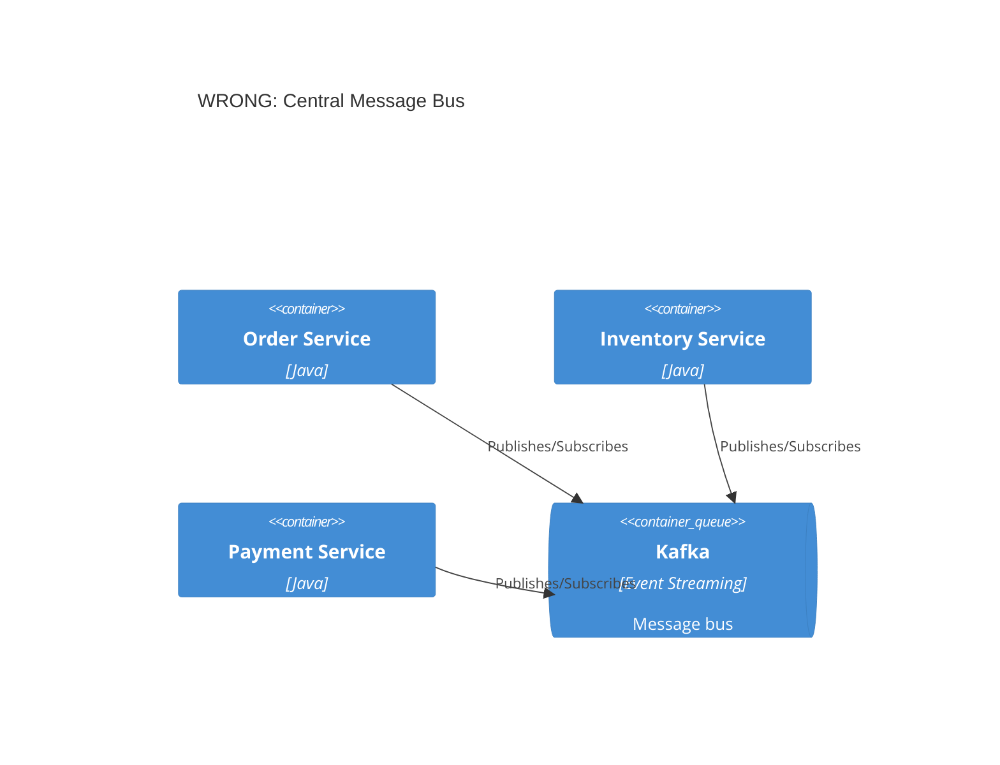
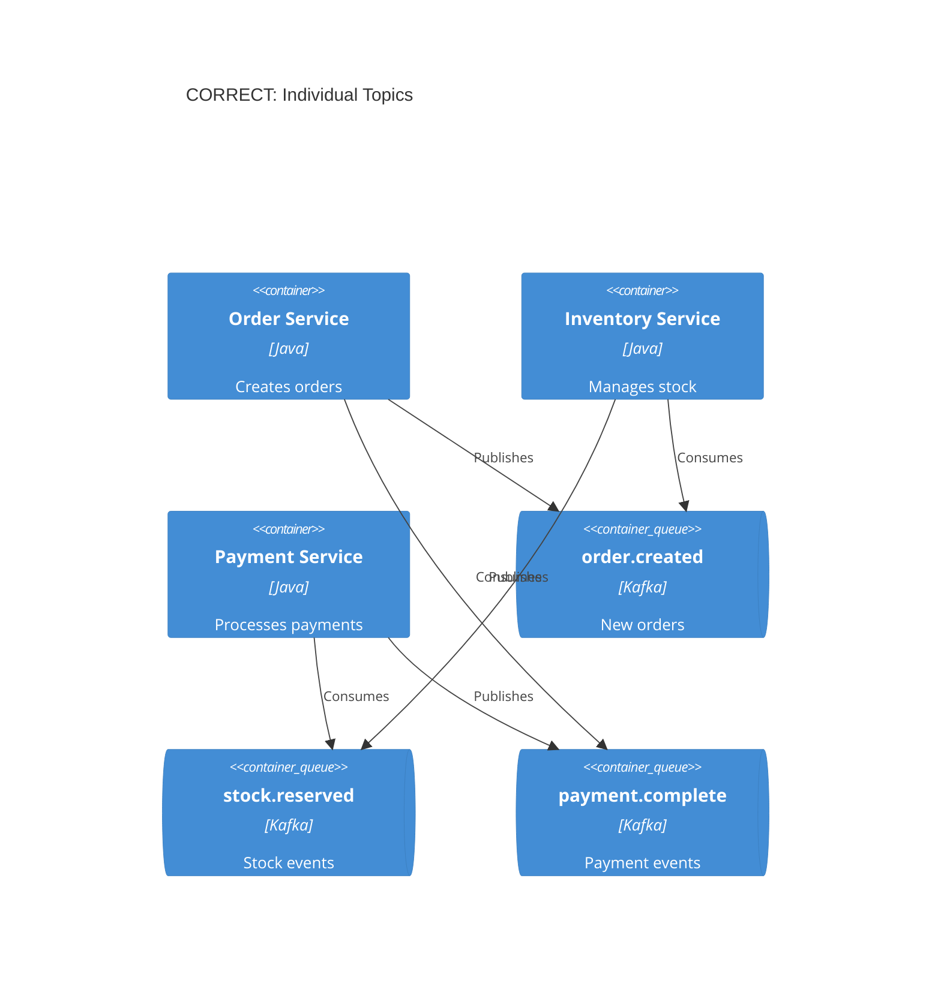
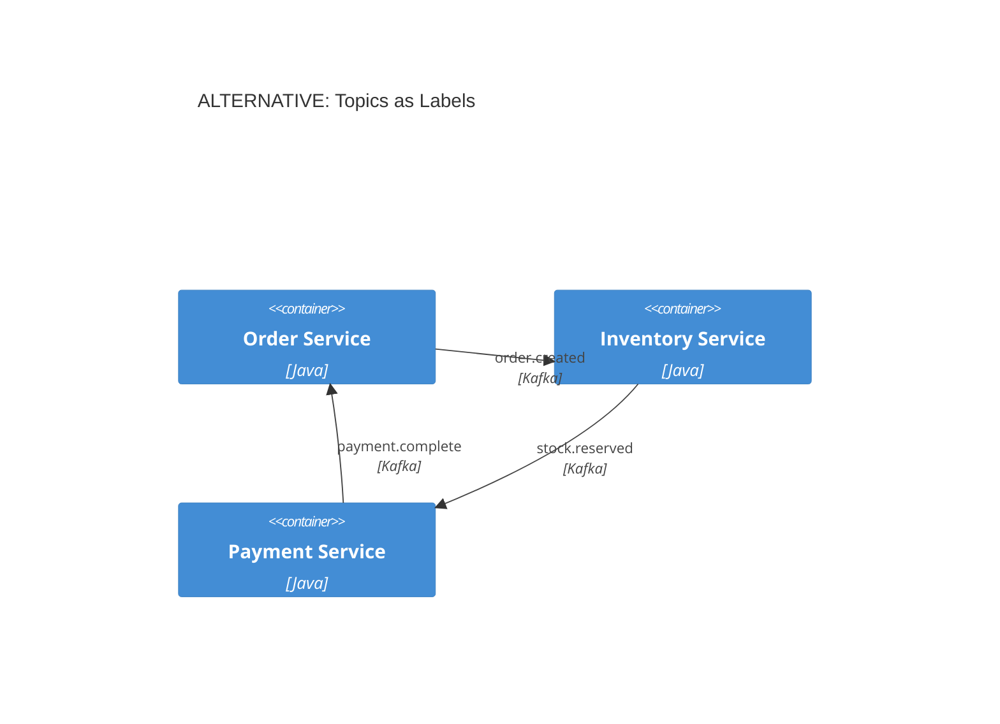
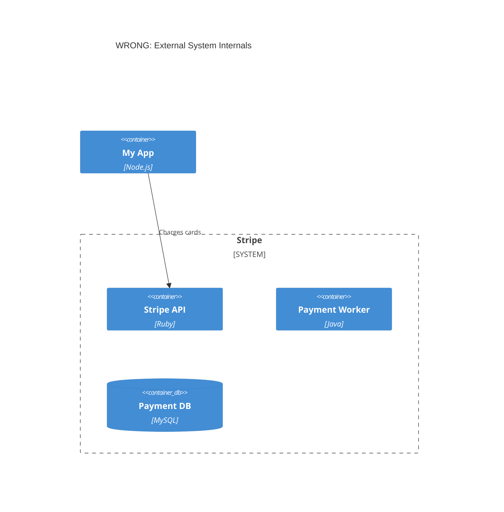
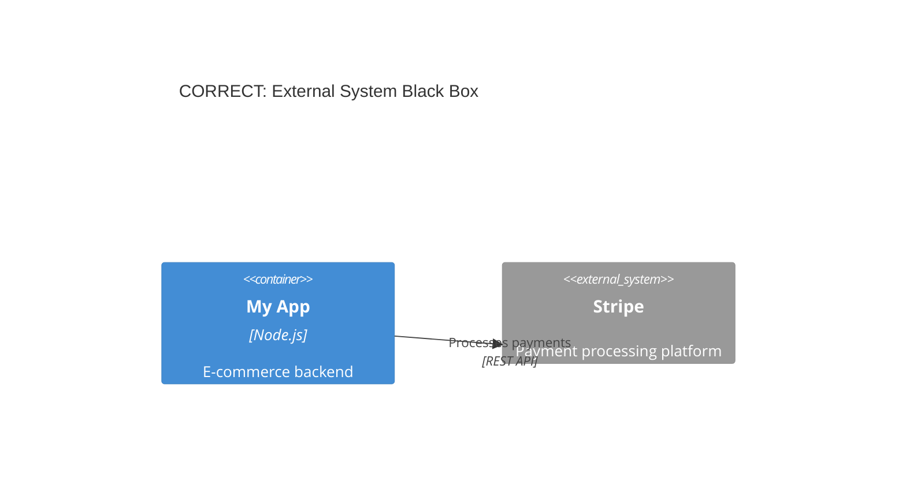

# Common C4 Model Mistakes to Avoid

This guide documents frequent anti-patterns and errors when creating C4 architecture diagrams, with examples of what to do instead.

## Abstraction Level Mistakes

### 1. Confusing Containers and Components

**The Problem:**
Containers are **deployable units** (applications, services, databases). Components are **non-deployable elements inside a container** (modules, classes, packages).

**Wrong - Java class shown as container:**


**Correct - Classes as components inside a container:**


### 2. Adding Undefined Abstraction Levels

**The Problem:**
C4 defines exactly four levels. Don't invent "subcomponents", "modules", or other arbitrary levels.

**Wrong:**
- Level 3.5: "Subcomponents"
- Level 2.5: "Microservice groups"
- Custom levels like "packages" or "modules"

**Correct:**
Stick to Person, Software System, Container, Component. If you need more detail, you're at Level 4 (Code) which should use UML class diagrams.

### 3. Vague Subsystems

**The Problem:**
"Subsystem" is ambiguous. Is it a system, container, or component?

**Wrong:**
```
Subsystem(orders, "Order Subsystem", "Handles orders")
```

**Correct - Be specific:**
```
System(orderSystem, "Order System", "Handles order lifecycle")
# OR
Container(orderService, "Order Service", "Java", "Order processing API")
# OR
Component(orderProcessor, "Order Processor", "Spring Bean", "Order business logic")
```

## Shared Libraries Mistake

**The Problem:**
Modeling a shared library as a container implies it's an independently running service. Libraries are copied into applications, not deployed separately.

**Wrong - Library as separate container:**


**Correct - Show library within each service:**


Or simply omit the library from architecture diagrams since it's an implementation detail.

## Message Broker Mistakes

### Single Message Bus Anti-Pattern

**The Problem:**
Showing Kafka/RabbitMQ as a single container creates a misleading "hub and spoke" diagram that hides actual data flows.

**Wrong - Central message bus:**


**Correct - Individual topics:**


**Alternative - Topics on relationship labels:**


## External Systems Mistakes

### Showing Internal Details of External Systems

**The Problem:**
You don't control external systems. Showing their internals creates coupling and becomes stale quickly.

**Wrong - External system internals:**


**Correct - External system as black box:**


## Metadata and Documentation Mistakes

### 1. Removing Type Labels

**The Problem:**
Removing element type labels (Container, Component, System) to "simplify" diagrams creates ambiguity.

**Wrong:**
```
Box(api, "API")  # What is this? System? Container? Component?
```

**Correct:**
```
Container(api, "API Application", "Spring Boot", "REST API backend")
```

### 2. Missing Descriptions

**The Problem:**
Elements without descriptions force viewers to guess their purpose.

**Wrong:**
```
Container(svc, "Service", "Java")
```

**Correct:**
```
Container(orderSvc, "Order Service", "Spring Boot", "Manages order lifecycle and fulfillment")
```

### 3. Generic Relationship Labels

**The Problem:**
Labels like "uses" or "communicates with" don't explain what data flows or why.

**Wrong:**
```
Rel(frontend, api, "Uses")
Rel(api, db, "Accesses")
```

**Correct:**
```
Rel(frontend, api, "Fetches products, submits orders", "JSON/HTTPS")
Rel(api, db, "Reads/writes order data", "JDBC")
```


---

See also: [common-mistakes-advanced.md](common-mistakes-advanced.md) for scope, arrow, deployment, consistency, and decision-documentation mistakes.
