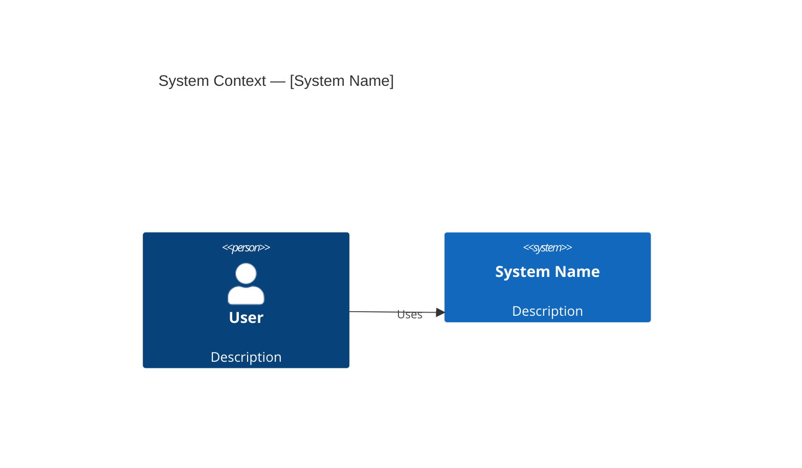
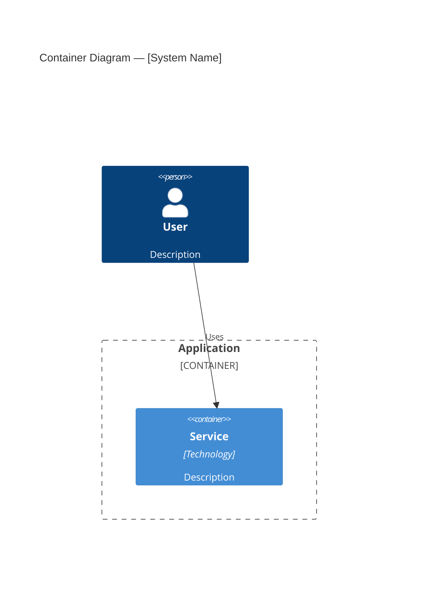

## System Overview
[1–2 sentence summary]

## C4 Architecture Diagrams

### Level 1 — System Context

### Level 2 — Container

## Architecture Decision Records (ADRs)

### ADR-001: [Decision Title]
- **Status:** Accepted
- **Context:** 
- **Decision:** 
- **Consequences:** 

## Data Model
[Omit if trivial — use database-schema-designer skill for detail]

## Interface Contracts
[API signatures, event schemas, or message formats]

## Constraints
- 

## Dependencies
| Dependency | Type | Owner | Risk |
|---|---|---|---|
| | | | |

## Open Questions
- [ ] 
